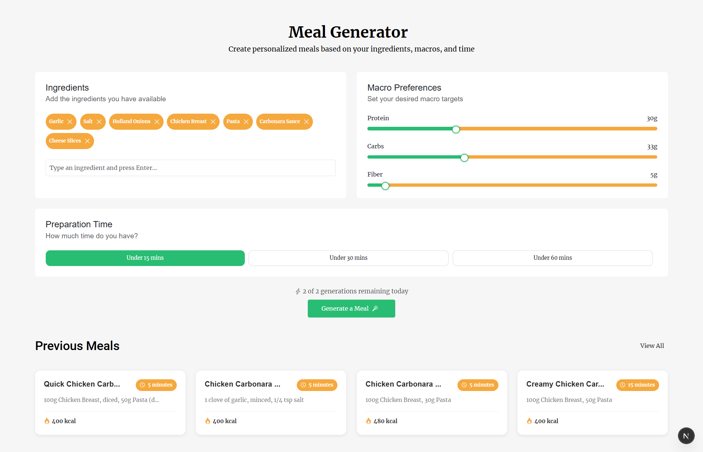
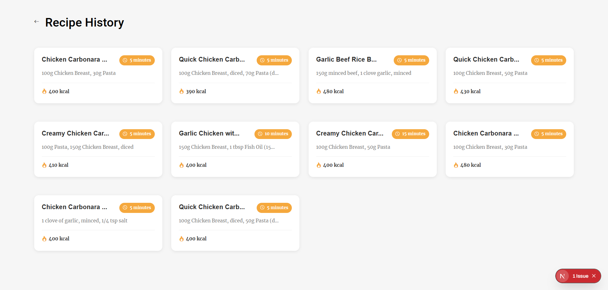

# AI Meal Maker 🍳

An intelligent meal planning application that generates personalized recipes based on your available ingredients, macro preferences, and time constraints.


*Generate personalized meals with AI*

## Features ✨

- **🥗 Smart Recipe Generation**: Create custom recipes using AI based on your ingredients
- **📊 Macro Tracking**: Set protein, carbs, and fiber targets for your meals
- **⏱️ Time-Based Cooking**: Choose recipes that fit your schedule (15, 30, or 60 minutes)
- **📱 Recipe History**: Save and revisit your generated meals
- **🖼️ Beautiful Recipe Cards**: Each recipe includes relevant food imagery
- **⚡ Rate Limiting**: Fair usage with 2 free meal generations per day

## Screenshots 📸

### Main Generator Page
The meal generator interface allows you to input ingredients, set macro preferences, and choose preparation time.


*Detailed recipe view with ingredients and step-by-step instructions*

### Recipe History
Browse through all your previously generated meals.


*Your complete recipe history*

## Getting Started 🚀

First, install dependencies:

```bash
npm install
# or
yarn install
```

Then, create a `.env.local` file with your API keys:

```env
OPENAI_API_KEY=your_openai_api_key
NEXT_PUBLIC_UNSPLASH_ACCESS_KEY=your_unsplash_api_key
```

Run the development server:

```bash
npm run dev
# or
yarn dev
```

Open [http://localhost:3000](http://localhost:3000) with your browser to see the application.

## Tech Stack 🛠️

- **Framework**: Next.js 14 (App Router)
- **Language**: TypeScript
- **Styling**: Bootstrap 5 + SCSS
- **AI**: OpenAI API
- **Images**: Unsplash API

## How It Works 🔧

1. **Select Ingredients**: Add or remove ingredients you have available
2. **Set Macros**: Adjust protein, carbs, and fiber targets using sliders
3. **Choose Time**: Select your available cooking time
4. **Generate**: Click "Generate a Meal" to create your personalized recipe
5. **Save & Cook**: Your recipe is automatically saved to history

## Rate Limiting 🚦

- Free users: 2 meal generations per day
- Rate limits reset daily at midnight
- Localhost has unlimited generations for development

## Project Structure 📁

```
src/
├── app/
│   ├── api/
│   │   └── generate-meal/     # API routes for meal generation
│   ├── components/            # Reusable components
│   ├── generate-meals/        # Main generator page
│   ├── generated-meals/       # Recipe history & details
│   └── types/                 # TypeScript interfaces
```

## Learn More 📚

To learn more about the technologies used:

- [Next.js Documentation](https://nextjs.org/docs)
- [OpenAI API](https://platform.openai.com/docs)
- [Bootstrap Documentation](https://getbootstrap.com/docs)

## Deploy on Vercel 🌐

The easiest way to deploy your Next.js app is to use the [Vercel Platform](https://vercel.com/new?utm_medium=default-template&filter=next.js&utm_source=create-next-app&utm_campaign=create-next-app-readme).

Check out the [Next.js deployment documentation](https://nextjs.org/docs/app/building-your-application/deploying) for more details.

## License 📄

MIT

---

Made with ❤️ using Next.js and OpenAI
